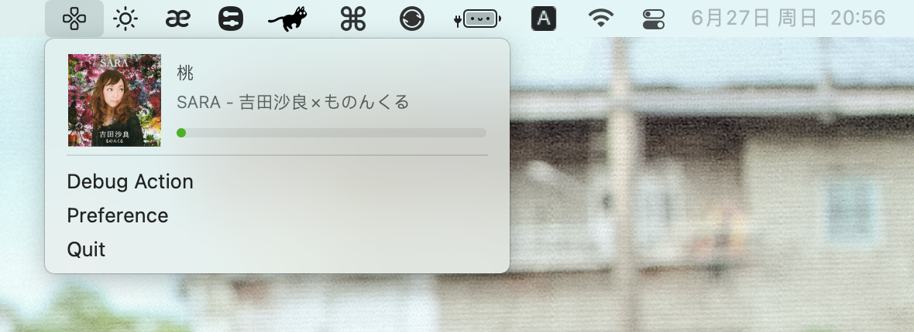

# Remote master

Remote Master is an Apple Remote utility to enhance the IR remote control of macOS. It has some useful features and still under construction. (for macOS 10.11 and above)

## Current working features:

- Control any media player application that can monitor media keys.
- Control applications with priority. If one application is not playing, it will send the event to the next app. For now, the first app will be iTunes, then VOX, then other apps.
- Long press the menu button to eject the optical drive.
- Built-in AirPlay audio server.

## Plans:

- Add more exclusively controllable apps.
- Change applications priority to control.
- Configurable voice menu to execute useful actions.
- Apply shortcuts to remote keys.

This app is using [HIDRemote(BSDv3)](https://github.com/iospirit/HIDRemote) to handle Apple Remote event, [AirTunes(Apache 2.0)](https://github.com/megabitsenmzq/airtunes) to handle AirPlay.

The app icon is designed by myself, you can like me on [Dribbble](https://dribbble.com/shots/14594252-Remote-Icon).
